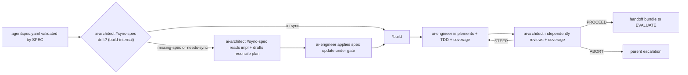

# mutagent-builder

The **ADL ② BUILD** stage. Invoke this skill after `mutagent-agentspec` has emitted and validated an
`agentspec.yaml`. BUILD consumes the Definition, implements it into the chosen target, and hands the
result to EVALUATE.

## §0 — Setup Detection

`mutagent-builder` ships the write-capable `ai-engineer` Actor and read-only `ai-architect` Verifier.
The parent session routes `*build` here through Helix; BUILD ownership stays in this package. The
`*sync-spec` COMMAND lives in `mutagent-agentspec` and delegates its code-read to this package's
`ai-architect #sync-spec` mode (Helix-mediated) — builder owns the reader, agentspec owns the command.

## §0.1 — Star-commands

| Command | Kind | Owner | Binds | Purpose |
|---|---|---|---|---|
| `*build` | agent-chain | own (full) | `references/workflows/build-protocol.md` + `assets/agents/*` | Implement a schema-valid `agentspec.yaml` into the pinned target framework/harness with TDD + coverage gates. |

> **`*sync-spec` is NOT a builder command** — `mutagent-agentspec` owns it. Builder provides the
> `ai-architect #sync-spec` MODE (the single implementation-reader): the deterministic freshness probe
> `scripts/sync-spec/check-sync-spec.ts` + `assets/agents/ai-architect.md#sync-spec` (read-only draft) +
> `assets/agents/ai-engineer.md` (gated write). AgentSpec's `*sync-spec` delegates to this mode; `*build`
> reuses it build-internally on drift. Reverse-generate = drift-from-nothing → cold construct + warm
> reconcile are one op.

### Star-command resolution contract

When you encounter a `*<name>` token:
1. **RESERVED** — `*` marks a command. NOT prose, NOT a file path, NOT an external shortcut.
2. **RESOLVE** — look up `<name>` in the table above. Not found ⇒ ERROR + ask the operator.
3. **BINDING** — read `Kind` + `Binds`:
   - `script` ⇒ call the bound script via `scripts/cli/run.sh`.
   - `agent-chain` ⇒ load + run the bound workflow steps in order.
   - `hybrid` ⇒ call script(s) for deterministic parts, then use the bound agent contract for judgment/writes.
4. **PRE-GATE** — load any pre-gate references the workflow declares.
5. **EXECUTE** — run the steps in order. Invent nothing.

## §1 — Triggers

This skill activates on:
- `mutagent-builder` · `/mutagent-builder`
- `*build` · `build` · `implement the spec` · `build the agent` · `scaffold the agent`

> `*sync-spec` intents (`spec sync` · `sync the spec` · `code drifted from spec` · …) route to
> `mutagent-agentspec`, which delegates the code-read to this package's `ai-architect #sync-spec`.

## §2 — Architecture

## §3 — Bill of materials

| Surface | Path |
|---|---|
| Authoritative BUILD protocol | `references/workflows/build-protocol.md` |
| OPTIMIZE handoff contract | `references/workflows/optimize-handoff.md` |
| Operative principles | `references/principles.md` |
| BUILD Actor | `assets/agents/ai-engineer.md` |
| BUILD Verifier / sync-spec analyst | `assets/agents/ai-architect.md` |
| Spec-sync freshness probe | `scripts/sync-spec/check-sync-spec.ts` |
| Build input preflight | `scripts/handoff/validate-build-input.ts` |
| Spec implementation coverage gate | `scripts/verify/spec-impl-coverage.ts` |
| Build report template | `assets/templates/build-report.md.tpl` |

## §4 — Boundary

- SPEC emits and validates `agentspec.yaml`; it does not own executable BUILD.
- BUILD owns implementation, drift resync, TDD, and `spec-impl-coverage`.
- EVALUATE judges and may emit EDD change requests.
- DIAGNOSE performs RCA; agentspec-backed implementation remedies return to BUILD.
- BUILD ownership stays in this package and is routed as ADL BUILD.
